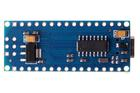
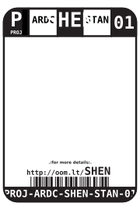
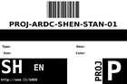
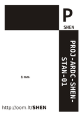

Contents
========

* [SHEN > ](#shen--)
	* [Images](#images)
	* [Tags](#tags)
  
![][im]
# SHEN > 

- ID: PROJ-ARDC-SHEN-STAN-01
- Hex ID: SHEN
- Name: Compatible Arduino Shennie
- Description: Compatible Arduino Shennie
- Long Link: [http://oom.lt/PROJ-ARDC-SHEN-STAN-01](http://oom.lt/PROJ-ARDC-SHEN-STAN-01)
- Short Link: [http://oom.lt/SHEN](http://oom.lt/SHEN)

## Images
  
  

|image|image_TOP|image_BOTTOM|diagBBLS|diagDIAG|diagIDEN|diagSCHEM|diagSIMP|label-front|label-inventory|label-spec|
| :---: | :---: | :---: | :---: | :---: | :---: | :---: | :---: | :---: | :---: | :---: |
||||||||||||

## Tags

- oompType: PROJ
- oompSize: ARDC
- oompColor: SHEN
- oompDesc: STAN
- oompIndex: 01
- hexID: SHEN
- oompAbout: An open sourced version of the widely available Shennie Arduino Compatible board (like an Arduino nano but with a CH340 USB to serial converter).
- numComponents: 14
- numUniqueComponents: 9
- component: [['compIndex', '1'], ['compIden', 'U1'], ['compIden', 'U1'], ['compID', 'ICIC-TQ32-X-K328-01'], ['compWhy', ''], ['compDesc', '']]
- ooPin1: TX1
- ooPin2: RX0
- ooPin3: RST
- ooPin4: GND
- ooPin5: D2
- ooPin6: D3
- ooPin7: D4
- ooPin8: D5
- ooPin9: D6
- ooPin10: D7
- ooPin11: D8
- ooPin12: D9
- ooPin13: D10
- ooPin14: D11
- ooPin15: D12
- ooPin16: D13
- ooPin17: 3V3
- ooPin18: REF
- ooPin19: A0
- ooPin20: A1
- ooPin21: A2
- ooPin22: A3
- ooPin23: A4
- ooPin24: A5
- ooPin25: A6
- ooPin26: A7
- ooPin27: 5V
- ooPin28: RST
- ooPin29: GND
- ooPin30: VIN
- ooNumPins: 30
- oompSymbol: twoSidedPackage;##ooNumPins@@
- ooDesignator: U1
- ooDesignator1: U
- oompID: PROJ-ARDC-SHEN-STAN-01

[im]: image_450.jpg
